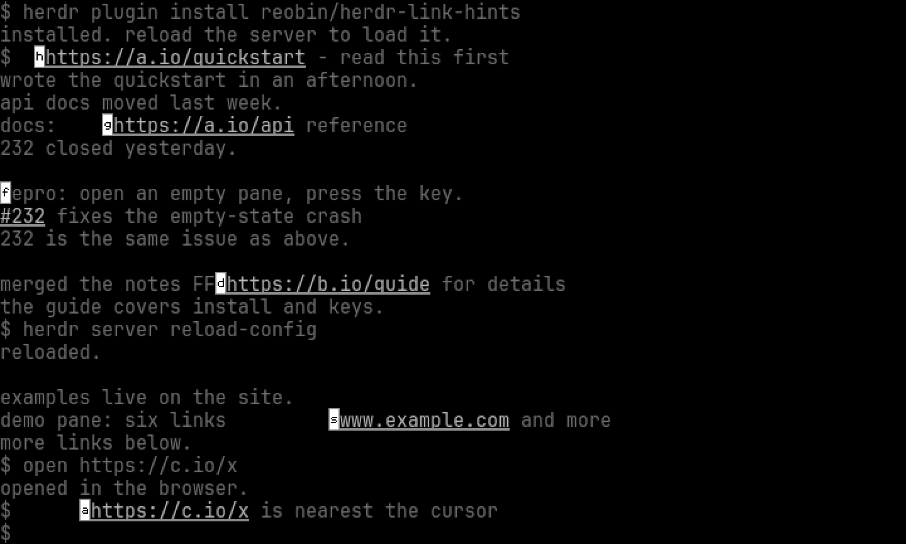

# herdr-link-hints

Vimium-style keyboard link hints for [Herdr](https://herdr.dev).
Tap a key, get a hint code drawn beside every link on screen, type the
code to open it.

## Install

Needs Herdr 0.9.0+. A prebuilt binary is downloaded for macOS and Linux
on arm64 and amd64; no toolchain required.

```sh
herdr plugin install reobin/herdr-link-hints
```

Bind a key in `~/.config/herdr/config.toml`, then
`herdr server reload-config`:

```toml
[[keys.command]]
key = "prefix+f"
type = "plugin_action"
command = "herdr-link-hints.hints"
description = "hint links in focused pane"
```

## Use

Press the bound key. Every link on screen is underlined and gets a hint
code beside it, and the rest of the screen dims. Type the code; hints
that no longer match fade, and the match opens as soon as it is
unambiguous. Backspace edits, Enter opens a single match, Esc quits.

A small popup shows how many hints are left, and says `no match` when a
prefix has ruled them all out.



## Demo

`picker --demo` runs the picker over a fixed synthetic pane with no
Herdr connection, so screenshots, recordings, and regression tests are
deterministic:

```sh
go build -trimpath -o picker .
echo a | ./picker --demo
vhs demo.tape
```

`demo.gif` cycles the golden overlay states (full, narrowed, typed).
Rebuild it from the goldens after any overlay change:

```sh
ffmpeg -y -loop 1 -framerate 1 -t 1 -i internal/demo/testdata/golden/full.png -loop 1 -framerate 1 -t 1 -i internal/demo/testdata/golden/narrowed.png -loop 1 -framerate 1 -t 1 -i internal/demo/testdata/golden/typed.png -filter_complex "[0:v][1:v][2:v]concat=n=3:v=1:a=0,scale=1280:768:flags=neighbor,format=rgb24,split[s0][s1];[s0]palettegen[p];[s1][p]paletteuse" demo.gif
```

Refresh the goldens with `UPDATE_GOLDEN=1 go test ./internal/demo/`.
`TestRenderBudget` fails the build when a full-screen render exceeds
2s; `go test -bench . ./...` tracks render speed.

The hints are drawn with Herdr's pane graphics, which need a terminal
with Kitty graphics support, and in the colours the terminal reports for
itself. Without Kitty graphics there are no badges to draw on, so the
picker falls back to a code list.

## From source

Needs Go 1.24+.

```sh
go build -trimpath -o picker .
herdr plugin link /path/to/herdr-link-hints
```

## Settings

| Variable | Default | Effect |
| --- | --- | --- |
| `HINTS_WIDTH` | square of the cell | picker popup width |
| `HINTS_HEIGHT` | 5 | picker popup height |
| `HINTS_PLACEMENT` | popup | picker pane placement; only popup takes a size |
| `HINTS_NO_OBSERVE` | unset | skip the observe stream when set |
| `HINTS_DEBUG` | unset | log to stderr, or to the named file |
