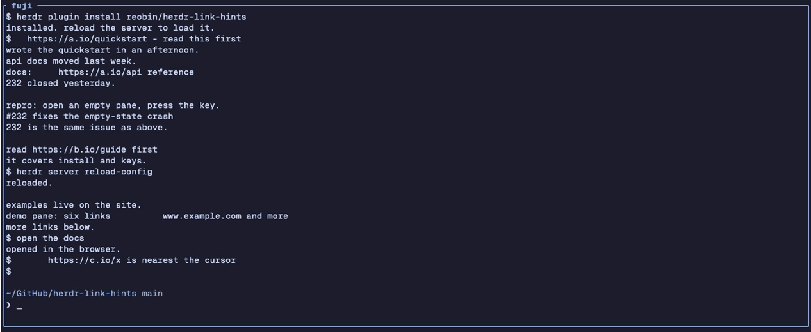

# herdr-link-hints

Keyboard link hints for [herdr](https://herdr.dev).
Tap a key, get a popup listing the links on screen, pick a row
to open one.

Each row is one link: its URL, each URL listed once.

Move with the arrow keys or j/k and confirm with Enter.



## Install

Needs herdr 0.9.2+.

```sh
herdr plugin install reobin/herdr-link-hints
```

Bind a key in `~/.config/herdr/config.toml`, then
`herdr server reload-config`:

```toml
[[keys.command]]
key = "prefix+f"
type = "plugin_action"
command = "herdr-link-hints.hints"
description = "hint links in focused pane"
```

## Build from source

Needs Go 1.24+.

```sh
go build -trimpath -o picker .
herdr plugin link /path/to/herdr-link-hints
```

## License

[MIT](LICENSE)
